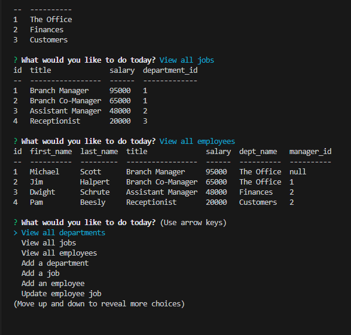

# Track-The-Employees

## License

A permissive license that allows users to do almost anything with the code as long as they provide attribution back to the author and don’t hold the author liable. This license is widely used for its simplicity and permissiveness.

## Description
This application is a way to view your departments, the jobs in each department as well as each employee, their title, id's, salary etc. 

Here is a link to the live demo: 
https://drive.google.com/file/d/1hYPMafLrSuIkyYWQO9Vu2JQAePRI-Quv/view

## Table of Contents
- [Description](#description)
- [Installation](#installation)
- [Usage](#usage)
- [License](#license)
- [Questions](#questions)

## Installation
This application requires Node.js, and packages: inquirer, mysql2, and console.table.

## Usage
* Type into your CLI "npm start" to get started and follow the prompts. 
* The main menu will follow.

Here is a link to the live demo: 
https://drive.google.com/file/d/1hYPMafLrSuIkyYWQO9Vu2JQAePRI-Quv/view

## Questions
For any questions or concerns, please reach out to me through the following contact information:

- Github: [DntTstMe](https://github.com/DntTstMe)
- Email: lex.tester93@gmail.com